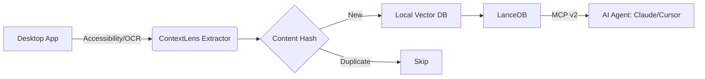

# 🔍 ContextLens

<p align="center">
  
  
  
  
</p>

---

### **The "Zero-API" Knowledge Bridge for AI Agents**

**ContextLens** is an open-source, local-first background daemon and Model Context Protocol (MCP) server. It bridges the "context gap" by turning non-API desktop applications—like **Apple Notes**, **UpNote**, **Legacy ERPs**, and **Slack/Teams huddles**—into queryable, semantic knowledge bases for your AI agents.

> "If you can see it on your screen, your AI agent can now reason about it." 🦞

---

## ✨ Key Features

### 🚀 **Advanced Extraction**
*   **OS Accessibility Scraping**: High-fidelity text extraction using native macOS/Windows accessibility trees.
*   **Firecrawl-style Markdown**: Transforms messy UI layouts into clean, semantic Markdown perfectly optimized for LLMs.
*   **Local OCR Fallback**: Integrated Tesseract/EasyOCR for applications that hide text behind custom canvases.

### 🧠 **Intelligent Memory (Local RAG)**
*   **Continuous Indexing**: A silent background watcher that maps your workspace in real-time.
*   **Vector Search (LanceDB)**: Blazing fast semantic retrieval using local `all-MiniLM-L6-v2` embeddings.
*   **Privacy First**: 100% local. Your data, your screen, your embeddings—nothing ever leaves your machine.

### 🔌 **Modern MCP v2 Support**
*   **URI Resources**: Passive context injection via `contextlens://apps/{app}/latest`.
*   **Async Tasks (SEP-1686)**: Long-running "Deep Index" jobs for entire apps with status polling.
*   **Elicitation (SEP-382)**: Secure "Human-in-the-Loop" confirmation for destructive actions.
*   **Server Cards**: Automatic discovery for modern AI clients (Claude Desktop, Cursor, Zed).

---

## 🛠 How it Works



---

## 🧠 Agentic Use Cases

ContextLens transforms the desktop into an Agent API. Here are concrete prompts and workflows you can execute in Claude Desktop, Cursor, or any MCP client after connecting:

### 1. The "Deep-Search" Summarizer
**Prompt:** "Search ContextLens for everything about 'Q3 Budget' from the last hour. Summarize it and draft a status email."
**ContextLens Tool Used:** `search_context_knowledge(query="Q3 Budget", hours_ago=1)`
**Result:** The agent builds a report from Slack huddles, Excel cell texts, and legacy ERP screens *without any integration keys*.

### 2. The Crash Recovery Agent
**Prompt:** "What was I doing just before my system froze? Show me the last 5 indexed states from my active apps."
**ContextLens Tool Used:** `get_recent_history(limit=5)`
**Result:** Instant retrieval of unsaved work or lost context.

### 3. The Real-Time Transcriber
**Prompt:** "Monitor my active window every 30 seconds. If you see me editing a Notion page about 'Legal Review', append a timestamped log to a Markdown file."
**ContextLens Tool Used:** Continuous polling of `read_active_window()` or `check_app_update()`.
**Result:** A zero-API meeting transcriber or activity logger that works even for desktop-only apps.

### 4. The Onboarding Bot
**Prompt:** "Every time I open the CRM and you detect an error code via ContextLens, explain that code."
**ContextLens Tool Used:** `extract_as_markdown()` + agent-side reasoning.
**Result:** Automated assistance for complex legacy software.

---

## 🏗️ Architecture Deep Dive

ContextLens is not a simple screen scraper; it is a continuous, local-first semantic indexing pipeline. Here’s exactly what happens under the hood every 30 seconds:

### 1. Extraction Layer (`extractor.py`)
- **macOS Deep Trees:** We bypass simple OCR by default. Our AppleScript engine recursively unwraps the entire `NSAccessibility` tree, converting nested UI elements (Groups, Tables, SplitViews) into flat, ordered text. This preserves the spatial relationship of UI elements.
- **Firecrawl-Style Markdown:** The raw UI text is transformed into clean, LLM-optimized Markdown via heuristics that detect headers vs. content based on line length.
- **Fallback Cascade:** If the Accessibility tree is empty (e.g., canvas apps, Citrix), we automatically fall back to local Tesseract OCR.

### 2. Chunking & Embedding Strategy (`indexer.py`)
We prioritize **contextual contiguity** over naive recursive splitting:
- **Semantic-Aware Chunking:** We don't split on arbitrary character counts. The engine first splits on `\n\n` (paragraph boundaries) and only breaks when a chunk exceeds **500 characters**. This keeps reasoning steps intact.
- **Overlap Strategy:** Currently, we use discrete chunks. *(Planned: Adding a 50-character sliding window overlap between chunks to prevent retrieval fragmentation).*
- **Embedding Model:** We default to `all-MiniLM-L6-v2` (384 dimensions) via `sentence-transformers`. It runs **entirely on CPU**, generating vectors in sub-10ms.
- **Storage:** Vectors are stored in **LanceDB** (v0.30+), a columnar vector database built on Apache Arrow. This gives our index zero-copy interoperability with the PyData ecosystem (Pandas, Polars, PyArrow).

### 3. Deduplication Logic (`watcher.py`)
We maintain an **MD5 hash map** of the last indexed screen state. If a window hasn't changed, we skip embedding entirely, saving precious context window bandwidth.

---

## 🚀 Getting Started

### 1. Prerequisites
*   Python 3.11+
*   **macOS**: Native support.
*   **Windows**: Native UIAutomation support.
*   **OCR (Optional)**:
    ```bash
    brew install tesseract
    ```

### 2. Installation
```bash
# Clone the repository
git clone https://github.com/your-username/contextlens.git
cd contextlens

# Install dependencies with uv
uv sync
```

### 3. Running the Server
```bash
# Start the daemon and MCP gateway
uv run python -m src.contextlens.main
```

---

## 🔌 Connecting to AI Agents

### **Claude Desktop**
Add the following to your `~/Library/Application Support/Claude/claude_desktop_config.json`:

```json
{
  "mcpServers": {
    "contextlens": {
      "command": "uv",
      "args": [
        "--directory",
        "/absolute/path/to/contextlens",
        "run",
        "python",
        "-m",
        "src.contextlens.main"
      ]
    }
  }
}
```

### **Cursor / Zed**
Simply point the MCP server configuration to the same `uv` command. The **Server Card** at `contextlens://.well-known/mcp-server-card.json` will help the editor discover all available tools automatically.

---

## 🔮 Our Bet on the 2027 Agent Ecosystem

ContextLens is built on three core predictions about where the industry is heading:

1. **Small Language Models (SLMs) at the Edge:** By 2027, organizations will use small, task-specific AI models 3x more than general-purpose LLMs. We optimize for local inference engines like Ollama (MLX/GGUF), WebGPU, and MLX, not just cloud APIs.

2. **Agentic Swarms, Not Siloes:** Future workflows will involve multiple agents (Claude coding, Ollama summarizing, a custom CRUD agent) running simultaneously. ContextLens is designed to become the shared central nervous system for these swarms—a **Model Context Protocol (MCP)** native memory layer.

3. **Push Over Poll:** The MCP ecosystem is standardizing event-driven communication. We are committed to implementing **"Context Subscriptions"** the moment the MCP triggers specification is ratified, turning ContextLens into a reactive, event-driven context bus.

4. **Infinite Context via Dynamic Paging:** Huge context windows (1M+ tokens) still incur quadratic attention costs. We are building toward a **Dynamic Context Paging** system where agents fetch and evict context on-demand from our local memory store, rather than stuffing everything into a prompt.

---

## 🚀 Roadmap (v2027 Vision)

ContextLens aims to be the **universal memory substrate** for the local agent revolution. These are the high-impact features we need contributors for:

### 🌟 Phase 1: Pluggable Embedding Pipeline (BYOM)
**Goal:** Swap `all-MiniLM-L6-v2` with BGE-M3, Nomic Embed, or OpenAI/Cohere via a simple YAML config.
**Why:** AI engineers want to benchmark new embedding models against their own data.
**Status:** 🟡 Seeking Contributors

### 🌟 Phase 2: Agentic "Context Subscriptions" (Webhooks for RAG)
**Goal:** Agents should not poll. They should subscribe to semantic events (e.g., "notify me when a Slack message mentions `production error`").
**Spec:** Based on the MCP Triggers and Events charter.
**Status:** 🔴 Needs MCP Spec Finalization

### 🌟 Phase 3: Native Multimodal OS Streaming
**Goal:** Provide a continuous, low-latency stream of screen embeddings using local vision models (Moondream 2B, Qwen-VL).
**Status:** 🔴 Research Phase

### 🌟 Phase 4: Semantic vs. Episodic Memory
**Goal:** Split the LanceDB tables. Store **Semantic** knowledge (facts, specs) separately from **Episodic** knowledge (timelines of user actions).
**Status:** 🔴 Planned

### 🌟 Phase 5: Swarm-Ready Memory Sync
**Goal:** Allow multiple agents (Claude, Ollama, custom scripts) to write "breadcrumbs" and annotations to a shared LanceDB without locking.
**Status:** 🔴 Planned

---

## 🛡 Security & Ethics
*   **Audit Logs**: Every tool call and extraction is logged locally.
*   **Schema Safety**: Strict Pydantic validation on all agent inputs.
*   **Elicitation**: Destructive actions (like clearing the index) *require* explicit user confirmation.

---

## 🤝 Contributing
We love contributors! If you want to build a better bridge for AI agents, check out our [Contribution Guide](CONTRIBUTING.md).

## 📄 License
MIT © 2026-2027 ContextLens Team
