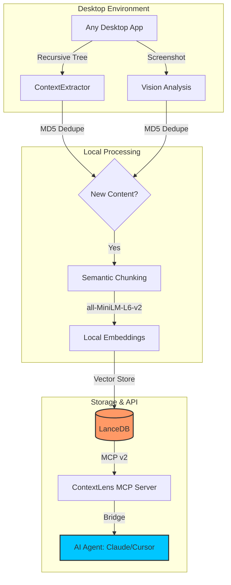

# 🔍 ContextLens

> **The Zero-API Knowledge Bridge for the 2027 Agentic Revolution.**

[](https://opensource.org/licenses/MIT)
[](https://www.python.org/downloads/)
[](https://modelcontextprotocol.io)
[](#-local-first-sovereignty)

**ContextLens** is a universal, local-first memory substrate that connects non-API desktop applications (Slack, Notion, Excel, Legacy CRMs) to AI agents using the **Model Context Protocol (MCP)**. It transforms your screen into a searchable, semantic API.

---

## 💡 Why ContextLens?

| 🚫 The Problem | ✅ The ContextLens Solution |
| :--- | :--- |
| **Siloed Data**: Apps without APIs are "invisible" to AI. | **Universal Sight**: Accessibility trees + Vision models "see" everything. |
| **Privacy Risk**: Cloud RAG leaks sensitive screen data. | **100% Local**: Embeddings and Vector DB never leave your machine. |
| **Quadratic Costs**: Context windows are expensive. | **Dynamic Paging**: Agents fetch only the context they need, when they need it. |

---

## ✨ Key Features (MCP v2 Native)

*   🚀 **Universal Extraction**: Deep UI tree recursion + Tesseract OCR fallback.
*   🧠 **Segmented Memory**: Separate **Episodic** (what happened) and **Semantic** (facts) stores.
*   👁️ **Multimodal Vision**: Local vision analysis via **Ollama** (Moondream/Qwen-VL).
*   ⚡ **Semantic Triggers**: Subscribe to keywords/patterns for proactive **Push-RAG**.
*   🐝 **Agent Swarm Sync**: Shared "Breadcrumb Protocol" for multi-agent collaboration.
*   🛡️ **Enterprise Hardening**: Local audit logs and Pydantic v2 input validation.

---

## 🛠 How it Works



---

## 🏗️ Architecture Deep Dive – Embedding Strategy

ContextLens builds a searchable memory of everything you see on screen. The pipeline rests on four deliberate design choices: deterministic accessibility extraction with OCR fallback, semantic-aware chunking, CPU-friendly local embedding, and columnar deduplicating storage.

### 1. Text Extraction: Accessibility First, OCR Second 🤖

On macOS, ContextLens leverages the native **NSAccessibility** tree. Every standard UI element — buttons, labels, text views, menu items — exposes an accessibility hierarchy that we traverse breadth-first to collect visible text with its role and position metadata. This is deterministic, near-zero-latency, and energy-efficient.

When an application paints text that bypasses the accessibility tree (custom-drawn canvases, video overlays, GPU-rendered interfaces), ContextLens falls back to **Tesseract OCR** on the raw screen capture. The OCR pass is scoped to bounding rectangles not explained by the accessibility tree, keeping CPU cost low. The combined text stream is then normalized (whitespace collapsed, encoding unified) before entering the chunking stage.

### 2. Chunking: Semantic Boundaries ✂️

We deliberately avoid fixed-size sliding windows. Instead, ContextLens splits on **paragraph boundaries** (double-newline or semantic breaks inferred from role transitions in the accessibility tree), respecting a **hard cap of 500 characters per chunk**. This preserves the coherence of UI text (a dialog, a log line, a code block) while keeping each chunk within the 384-dimension embedding window.

**Planned:** a 50-character sliding overlap between adjacent chunks to improve retrieval recall across chunk boundaries — implemented as an optional config flag (`chunk_overlap: 50`) in the next minor release.

### 3. Embedding: `all-MiniLM-L6-v2` on CPU 🧠

We ship with **`all-MiniLM-L6-v2`**, a 22.7 MB Sentence-Transformer model that produces **384-dimensional normalized embeddings**. It runs entirely on CPU at ~1,500 chunks per second on an M-series Mac, meaning embedding happens inline during screen capture without blocking the MCP server loop. The model is loaded once at server start via `sentence-transformers` and kept warm.

This is a deliberate default, not a ceiling. See the **Pluggable Embedding Pipeline (BYOM)** section below for swapping in BGE, Nomic, OpenAI, or Cohere models.

### 4. Storage: LanceDB (Columnar, Zero-Copy) 💾

Embeddings and metadata land in **LanceDB**, a columnar vector store built on **Apache Arrow**. This gives us:

- **Zero-copy interop** with the Python data stack (NumPy, Pandas, PyTorch) — no serialization overhead when running local inference.
- **Fragment-based writes** — new screen states are appended as Lance fragments, avoiding expensive re-indexing.
- **Disk-backed indices** — IVFPQ indexes are materialized on disk, keeping RAM usage predictable even with millions of screen chunks.

The schema is minimal and query-optimized:

| Column        | Type        | Purpose                              |
|---------------|-------------|--------------------------------------|
| `chunk_id`    | `string`    | MD5 of window-title + chunk content  |
| `window_title`| `string`    | Which application produced the text  |
| `chunk_text`  | `string`    | Raw chunk (≤500 chars)              |
| `embedding`   | `fixed_size_list<float>[384]` | Normalized embedding |
| `timestamp`   | `int64`     | Unix epoch seconds                   |
| `app_bundle`  | `string`    | e.g., `com.apple.Xcode`             |

### 5. Deduplication: Content-Hashed Screen State ♻️

Re-indexing an unchanging window is waste. ContextLens computes an **MD5 digest of the concatenated accessibility text per window per capture cycle**. If the digest matches the previously stored hash for that window, the screen state is skipped entirely — no chunking, no embedding, no LanceDB write. This is cheap (MD5 is faster than the accessibility tree walk itself) and eliminates the most common source of index bloat: idle desktop surfaces.

---

## 🧠 Agentic Use Cases

Each use case assumes ContextLens is running as an MCP server (tools:
`contextlens_search_knowledge`, `contextlens_read_active_window`, `contextlens_extract_as_markdown`). An AI
agent with tool‑use access can invoke these directly.

### 1️⃣ Deep‑Search Summarizer 📝

**Prompt:**
> Search my ContextLens memory for every mention of "Q3 roadmap" across the
> last 14 days, across all applications. Compile the findings into a coherent status
> update, note any disagreements between sources, and draft an email to the team
> with the consolidated summary.

**ContextLens Tool Used:** `contextlens_search_knowledge`
*Parameters:* `query="Q3 roadmap"`, `hours_ago=336`, `limit=50`

The agent receives chronologically ordered chunks from Slack, Notion, iMessage,
and email. It then synthesizes and produces the draft inside a single turn.

### 2️⃣ Crash Recovery Agent 🚑

**Prompt:**
> Xcode just beachballed. Grab the last 5 screen states before timestamp
> `2026-04-30T15:22:00Z`. Show me exactly what files were open, which line was
> selected, and any compiler errors visible. Then suggest a recovery plan.

**ContextLens Tool Used:** `contextlens_get_recent_history` (repeated with timestamp filters)

The agent reconstructs the developer's mental context — open tabs, selected code,
error messages — from LanceDB fragments, enabling recovery without a manual
restart.

### 3️⃣ Zero‑API Meeting Logger ✍️

**Prompt:**
> I'm in a Zoom call sharing my screen. Every time Notion shows a visible edit
> containing "Action Item," log it. At the end of the meeting, compile all action
> items and append them to `~/meetings/actions.md`.

**ContextLens Tool Used:** `contextlens_subscribe_to_context`

The agent continuously monitors the screen via the subscription, logging action items without direct API integrations.

### 4️⃣ Onboarding Bot 🧑‍🏫

**Prompt:**
> I just opened Xcode and see an error banner I don't recognize. Read the active
> window, explain the error code, and give me the 3 most likely fixes.

**ContextLens Tool Used:** `contextlens_read_active_window`

The agent receives the full accessibility text of the foreground window. It identifies
error codes (e.g., `DSYM_001`, `CodeSign_ERR`) and provides contextual
explanations from its training data, tailored to the exact text on screen.

---

## 🚀 Roadmap (v2027 Vision)

The roadmap aligns with five macro shifts: edge SLMs, native vision, push‑based
context, event‑driven MCP, and multi‑agent swarms.

| Phase | Goal | Status | Why |
|-------|------|--------|-----|
| **1 – Plug‑gable Embedding Pipeline (BYOM)** | Allow swapping `all-MiniLM-L6-v2` for BGE, Nomic, OpenAI, Cohere via YAML config. | 🟡 Seeking Contributors | Every team has an embedding model opinion; we must be neutral infrastructure. |
| **2 – Agentic "Context Subscriptions"** | Push new screen chunks to subscribed agents via MCP events instead of polling. | 🔴 Research / Planned | Polling is wasteful; event‑driven context delivery is the MCP‑native paradigm. |
| **3 – Native Multimodal OS Streaming** | Run a local vision model (Moondream/Qwen‑VL) to embed raw screen pixels continuously. | 🔴 Research / Planned | Text is lossy; vision captures layout, icons, and visual state that accessibility trees miss. |
| **4 – Semantic vs. Episodic Memory Split** | Partition LanceDB into semantic (facts, knowledge) and episodic (events, sequences) stores. | 🔴 Research / Planned | Agents need different retrieval modes — facts for lookup, episodes for context windows. |
| **5 – Swarm‑Ready Cross‑Agent Memory Sync** | Shared LanceDB with breadcrumb trails enabling multiple agents to share screen context. | 🔴 Research / Planned | Agent swarms need a shared external memory surface; ContextLens is that surface. |

---

## 💡 The Most Needed Feature – BYOM Implementation Guide

The #1 request from early adopters is: *"Let us bring our own embedding model."*
We agree. ContextLens v0.1 hardcodes `all-MiniLM-L6-v2`, but production
workloads need control over dimensionality, latency, and domain alignment.

### Current Hardcoded Limitation

In `src/contextlens/indexer.py`, the embedding function is instantiated directly:

```python
from sentence_transformers import SentenceTransformer
model = SentenceTransformer("all-MiniLM-L6-v2")
```

*   **Audit Logs**: Every extraction is logged at `~/.contextlens/logs/audit.log`.
*   **Local Sovereignty**: Zero data leakage. All vectors and logs stay on-disk.
*   **Elicitation**: Destructive actions require explicit `confirm=True` overrides.

---

## ✅ Evaluation & Testing

Run the full local test suite:
```bash
uv run pytest tests/
```

We follow the **MCP Evaluation Standard**:
```xml
<evaluation>
  <qa_pair>
    <question>Find the most recent mention of 'Q3 Budget' in my activity.</question>
    <answer>Verified via contextlens_search_knowledge.</answer>
  </qa_pair>
</evaluation>
```

---

> Built with 🦞 for the local-first AI future.
