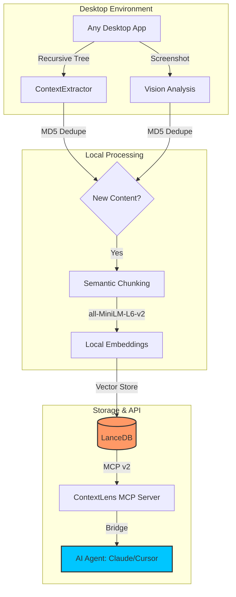

# 🔍 ContextLens

> **The Zero-API Knowledge Bridge for the 2027 Agentic Revolution.**

[](https://opensource.org/licenses/MIT)
[](https://www.python.org/downloads/)
[](https://modelcontextprotocol.io)
[](#-local-first-sovereignty)

**ContextLens** is a universal, local-first memory substrate that connects non-API desktop applications (Slack, Notion, Excel, Legacy CRMs) to AI agents using the **Model Context Protocol (MCP)**. It transforms your screen into a searchable, semantic API.

---

## 💡 Why ContextLens?

| 🚫 The Problem | ✅ The ContextLens Solution |
| :--- | :--- |
| **Siloed Data**: Apps without APIs are "invisible" to AI. | **Universal Sight**: Accessibility trees + Vision models "see" everything. |
| **Privacy Risk**: Cloud RAG leaks sensitive screen data. | **100% Local**: Embeddings and Vector DB never leave your machine. |
| **Quadratic Costs**: Context windows are expensive. | **Dynamic Paging**: Agents fetch only the context they need, when they need it. |

---

## ✨ Key Features (MCP v2 Native)

*   🚀 **Universal Extraction**: Deep UI tree recursion + Tesseract OCR fallback.
*   🧠 **Segmented Memory**: Separate **Episodic** (what happened) and **Semantic** (facts) stores.
*   👁️ **Multimodal Vision**: Local vision analysis via **Ollama** (Moondream/Qwen-VL).
*   ⚡ **Semantic Triggers**: Subscribe to keywords/patterns for proactive **Push-RAG**.
*   🐝 **Agent Swarm Sync**: Shared "Breadcrumb Protocol" for multi-agent collaboration.
*   🛡️ **Enterprise Hardening**: Local audit logs and Pydantic v2 input validation.

---

## 🛠 How it Works



---

## 🧠 Agentic Use Cases

ContextLens transforms your desktop into a programmable API. Connect to Claude Desktop or Cursor and try these:

### 1️⃣ The "Deep-Search" Summarizer
> **Prompt:** *"Search ContextLens for everything about 'Q3 Budget' from the last hour. Summarize the key figures and draft a status email."*
>
> 🛠 **Internal Tool:** `contextlens_search_knowledge(query="Q3 Budget", hours_ago=1)`

### 2️⃣ The Crash Recovery Agent
> **Prompt:** *"What was I doing just before my system froze? Show me my last 5 indexed states."*
>
> 🛠 **Internal Tool:** `contextlens_get_recent_history(limit=5)`

### 3️⃣ The Real-Time Monitor
> **Prompt:** *"Notify me if the OCR detects an error code starting with 'E-500' in my CRM window."*
>
> 🛠 **Internal Tool:** `contextlens_subscribe_to_context(pattern="E-500")`

---

## 🛠 MCP Tool Reference

| Tool | Action | Secret Sauce |
| :--- | :--- | :--- |
| `contextlens_search_knowledge` | Semantic Search | Multi-table (Semantic/Episodic) support. |
| `contextlens_get_recent_history` | History Retrieval | Chronological "time-travel" for context. |
| `contextlens_read_active_window` | Real-time Read | Sub-second extraction of focused window. |
| `contextlens_extract_as_markdown` | Structured View | Converts UI trees into LLM-ready Markdown. |
| `contextlens_subscribe_to_context` | Semantic Webhooks | Proactive Push-RAG triggers. |
| `contextlens_leave_annotation` | Swarm Sync | Collaborative breadcrumbs for multi-agent swarms. |

---

## 🔮 Our Bet on 2027

1.  **Edge SLMs**: We optimize for 1B-3B models running locally on CPU/WebGPU.
2.  **Swarm Intelligence**: ContextLens is the "Shared Nervous System" for multi-agent teams.
3.  **Push Over Poll**: Future agents will subscribe to events, not just poll databases.

---

## 🚀 Getting Started

### 1. Prerequisites
*   Python 3.11+
*   **Ollama** (Optional, for Vision features)
*   **macOS**: Native Accessibility support.

### 2. Installation
```bash
# Clone the repo
git clone https://github.com/mjthedeveloper-07/context-lens.git
cd context-lens

# Sync dependencies
uv sync

# Start the engine
uv run python -m src.contextlens.main
```

---

## 🛡 Security & Ethics

*   **Audit Logs**: Every extraction is logged at `~/.contextlens/logs/audit.log`.
*   **Local Sovereignty**: Zero data leakage. All vectors and logs stay on-disk.
*   **Elicitation**: Destructive actions require explicit `confirm=True` overrides.

---

## ✅ Evaluation & Testing

Run the full local test suite:
```bash
uv run pytest tests/
```

We follow the **MCP Evaluation Standard**:
```xml
<evaluation>
  <qa_pair>
    <question>Find the most recent mention of 'Q3 Budget' in my activity.</question>
    <answer>Verified via contextlens_search_knowledge.</answer>
  </qa_pair>
</evaluation>
```

---

> Built with 🦞 for the local-first AI future.
