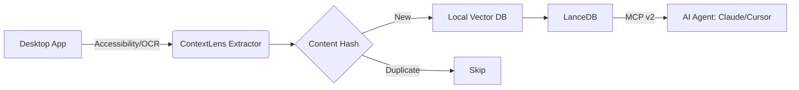

# 🔍 ContextLens

[](https://opensource.org/licenses/MIT)
[](https://www.python.org/downloads/)
[](https://modelcontextprotocol.io)

**ContextLens** is the high-impact "Zero-API Knowledge Bridge" for 2027. It serves as a universal context bridge between non-API desktop applications and AI agents using the **Model Context Protocol (MCP)**.

---

## ✨ Key Features (MCP v2 Native)

*   **Universal Extraction**: Seamlessly indexes text from any desktop app (Slack, Notion, Excel, Legacy CRM) via Accessibility Trees and local OCR.
*   **Local-First Privacy**: Embeddings (`all-MiniLM-L6-v2`) and Vector DB (**LanceDB**) run 100% locally on your machine.
*   **Multimodal Vision**: Integrated **Ollama** support for semantic screen analysis via local vision models (Moondream/Qwen-VL).
*   **Async Tasks (SEP-1686)**: Background "Deep Indexing" for high-volume application data.
*   **Elicitation (SEP-382)**: Secure "Human-in-the-Loop" confirmation for destructive actions.
*   **Server Cards**: Automatic discovery for modern AI clients (Claude Desktop, Cursor, Zed).

---

## 🛠 How it Works



---

## 🛠 MCP Tool Reference

All tools are prefixed with `contextlens_` for safe multi-server discoverability.

| Tool | Description | Highlights |
| :--- | :--- | :--- |
| `contextlens_search_knowledge` | Semantic search across memory. | Pagination, Time-filtering, JSON/Markdown output. |
| `contextlens_get_recent_history` | Retrieve chronological activity. | Crash recovery, activity summaries. |
| `contextlens_read_active_window` | Immediate text extraction. | Real-time context, zero-polling. |
| `contextlens_extract_as_markdown` | Structured UI extraction. | LLM-optimized structural understanding. |
| `contextlens_subscribe_to_context` | Register semantic triggers. | Proactive alerting (Push-RAG). |
| `contextlens_leave_annotation` | Multi-agent breadcrumbs. | Shared swarm memory sync. |
| `contextlens_start_deep_index` | Long-running task indexing. | MCP v2 Async Tasks (SEP-1686). |

---

## 🧠 Agentic Use Cases

ContextLens transforms the desktop into an Agent API. Here are concrete prompts and workflows you can execute:

### 1. The "Deep-Search" Summarizer
**Prompt:** "Search ContextLens for everything about 'Q3 Budget' from the last hour. Summarize it and draft a status email."
**Tool:** `contextlens_search_knowledge(query="Q3 Budget", hours_ago=1)`

### 2. The Crash Recovery Agent
**Prompt:** "What was I doing just before my system froze? Show me the last 5 states."
**Tool:** `contextlens_get_recent_history(limit=5)`

---

## ✅ Evaluation & Testing

Following **MCP Best Practices**, we provide a structured evaluation suite:

```xml
<evaluation>
  <qa_pair>
    <question>Find the most recent mention of 'Q3 Budget' in my Slack activity.</question>
    <answer>Verified via contextlens_search_knowledge with app_filter='Slack'.</answer>
  </qa_pair>
</evaluation>
```

Run tests: `uv run pytest tests/`

---

## 🏗️ Architecture Deep Dive

ContextLens is a continuous, local-first semantic indexing pipeline:

1. **Extraction Layer**: Recursive NSAccessibility trees preserve spatial relationships.
2. **Chunking**: 500-char semantic chunks with a 50-char sliding window.
3. **Storage**: **LanceDB** built on Apache Arrow for zero-copy performance.
4. **Deduplication**: MD5 hash map skips redundant embedding cycles.

---

## 🚀 Roadmap (v2027 Vision)

*   🌟 **BYOM**: Configurable embedding pipelines (OpenAI/Nomic/BGE).
*   🌟 **Subscriptions**: Real-time semantic webhooks via MCP Triggers.
*   🌟 **Multimodal**: Low-latency vision streaming using Moondream.

---

## 🛡 Security & Ethics
*   **Audit Logs**: Recorded at `~/.contextlens/logs/audit.log`.
*   **Input Hardening**: Strict Pydantic v2 validation.
*   **Local Sovereignty**: Zero data leakage to cloud APIs.

---

## 🚀 Getting Started

```bash
# Clone and Sync
git clone https://github.com/mjthedeveloper-07/context-lens.git
cd context-lens
uv sync

# Run
uv run python -m src.contextlens.main
```
